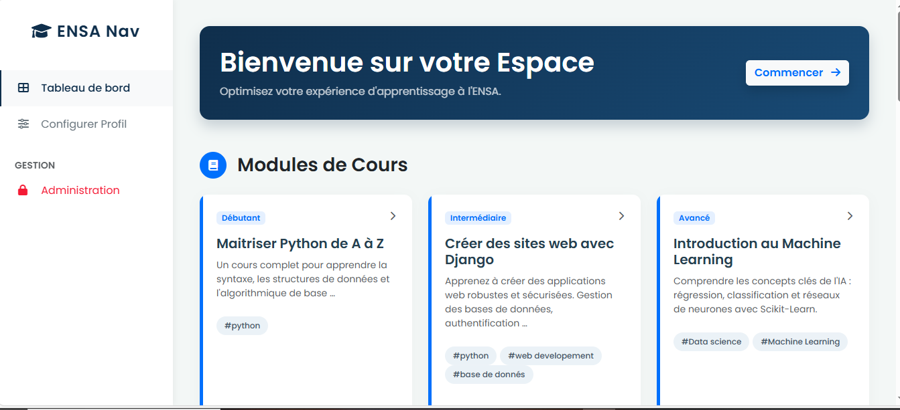
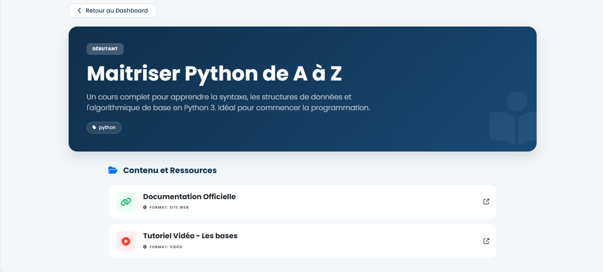
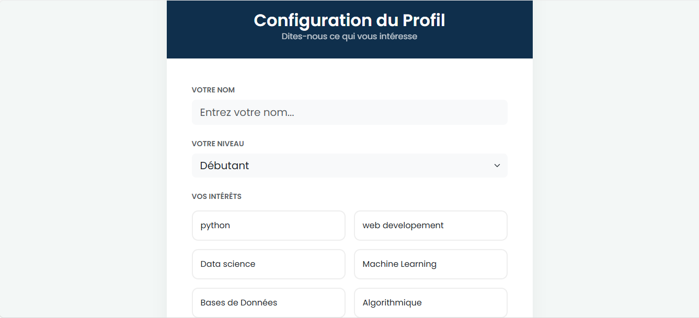

#  Academic Recommendation Platform

##  Description
Cette application web développée avec Django permet de gérer et recommander
des ressources académiques (cours, vidéos, sites web) aux étudiants.
Le projet a été réalisé dans le cadre d’un travail en équipe.

---

##  Objectifs du projet
- Centraliser des ressources pédagogiques
- Faciliter l’ajout et la gestion de contenus académiques
- Offrir une plateforme simple et claire pour les étudiants

---

##  Technologies utilisées
- Python
- Django 6.0.1
- SQLite
- HTML / CSS
- Bootstrap

---

##  Installation et lancement du projet

```bash
git clone [https://github.com/Basma-ElHachmi/Digital-creativity.git](https://github.com/Basma-ElHachmi/Digital-creativity.git)
cd Digital-creativity
python -m venv .venv
# ... (autres commandes)
python manage.py runserver
```

Une fois le serveur lancé, ouvrez votre navigateur à l'adresse : http://127.0.0.1:8000/

---

## Répartition des tâches

- **Base de données : Basma El Hachmi**  
  Responsable de la création et gestion de la base de données (db.sqlite3),  
  ajout des modèles dans `models.py` et insertion des premières données.

- **Frontend : Imane El Aroui**  
  Responsable de l’interface utilisateur (HTML/CSS/Bootstrap),  
  mise en page, responsivité et design des pages du site.

- **Documentation & README : Maroua El Orche**  
  Responsable de la documentation complète du projet,  
  création du fichier README.md et explication des fonctionnalités pour le professeur.

- **Algorithmes  : Nada Ech-chedadi**  
  Responsable de la logique de l’application :  
  récupération des données, filtrage selon les besoins,  
  et envoi des informations aux templates pour affichage.

- **Autres contributions : Équipe**  
  Toutes les autres tâches de coordination, tests et améliorations mineures.

---
## Captures d'écran du site






